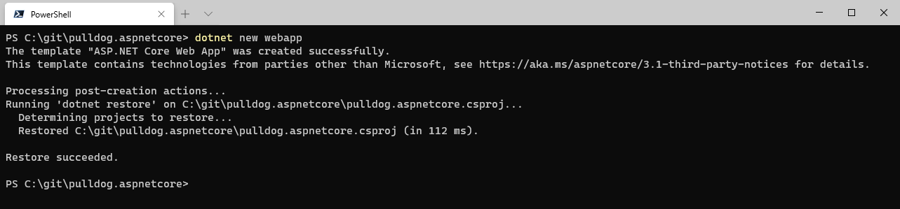
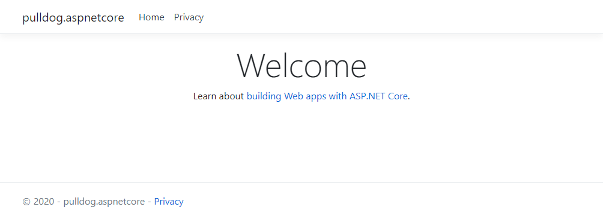
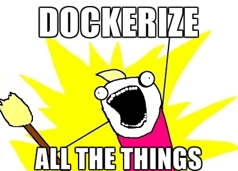
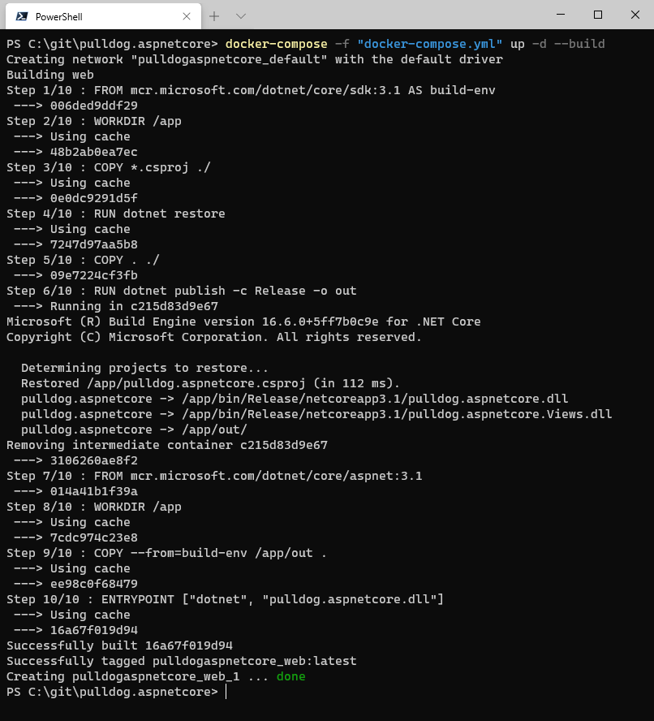

# pulldog.aspnetcore

## Starting the project

This is a small guide for getting started with pulldog. This project will be based on the AspNet Core WebApp template using Razor pages. But feel free to use whatever floats your boat.

I will be starting creating a new project from the commandline. 

```shell
$ dotnet new webapp
```



Running the project will just show you the basic template page like so:



## Dockerize



With the code running we can start creating our dockerfile, which will later be used by pulldog to create a test enviroment.

I used this example to create my own dockerfile:
https://docs.docker.com/engine/examples/dotnetcore/

And you can see the result below here.

```dockerfile
FROM mcr.microsoft.com/dotnet/core/sdk:3.1 AS build-env
WORKDIR /app

# Copy csproj and restore as distinct layers
COPY *.csproj ./
RUN dotnet restore

# Copy everything else and build
COPY . ./
RUN dotnet publish -c Release -o out

# Build runtime image
FROM mcr.microsoft.com/dotnet/core/aspnet:3.1
WORKDIR /app
COPY --from=build-env /app/out .
ENTRYPOINT ["dotnet", "pulldog.aspnetcore.dll"]
```

With the dockerfile in place, we can now focus on creating a docker-compose.yml file. Again I used docs from docker own homepage to build it. I am sharing an advanced docker-compose.yml file which also shows how you could start a MsSQL database with your project. You can find it here: https://docs.docker.com/compose/aspnet-mssql-compose/

If you are starting from scratch like me you can just use the same on as me below here:

```docker-compose.yml
version: "3"
services:
    web:
        build: .
        ports:
            - "5000:80"
```

To test it all out try and run the project using the docker-compose.yml file.

```shell
$ docker-compose -f "docker-compose.yml" up -d --build
```
You should then be able to visit the site again on port 5000.




Disclaimer. Pulldog is made by a good friend of mine.